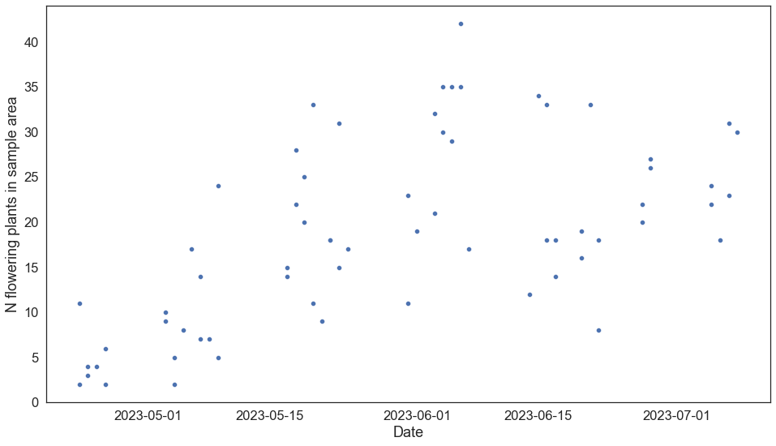
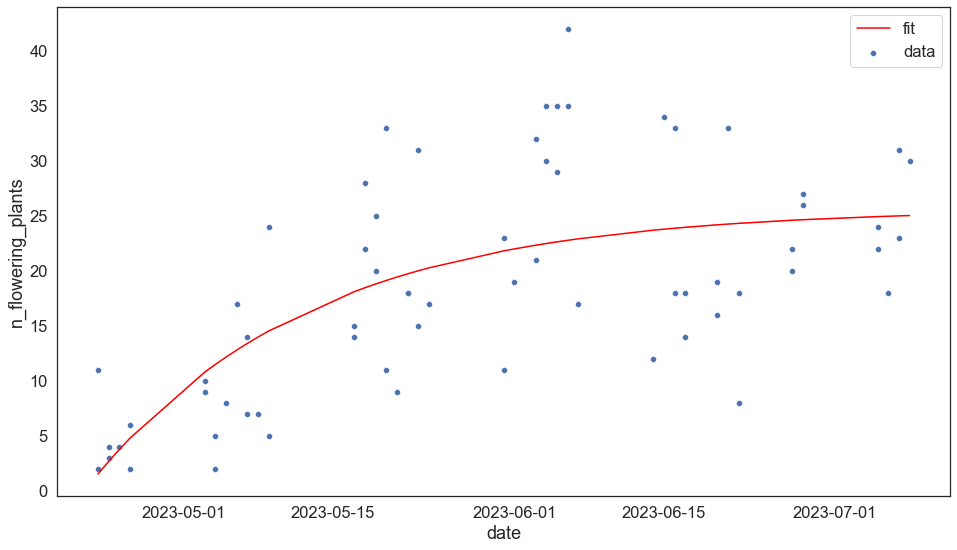

```python
import pandas as pd
import numpy as np
import seaborn as sns
import matplotlib.pyplot as plt
import matplotlib.dates as mdates
import scipy.stats as stats

from datetime import datetime, timedelta
from scipy.optimize import curve_fit


```


```python
%matplotlib inline

# Seaborn defaults
sns.set_theme()
sns.set(style = 'white', font_scale = 1.5, rc = {'figure.figsize':(16, 9)})
```


```python
bee = pd.read_csv('../../Google Drive/job_tech_learning/data/Bumblebeesandfl/MT_2023_Bee_Plant_Data.csv')
bee.head()
```


<div>
<style scoped>
    .dataframe tbody tr th:only-of-type {
        vertical-align: middle;
    }

    .dataframe tbody tr th {
        vertical-align: top;
    }

    .dataframe thead th {
        text-align: right;
    }
</style>
<table border="1" class="dataframe">
  <thead>
    <tr style="text-align: right;">
      <th></th>
      <th>Site ID</th>
      <th>Date</th>
      <th>Bee Survey Length (min)</th>
      <th>Number of Bumble Bees Captured</th>
      <th>Number of Plant Species in Flower</th>
      <th>List of Plant Species in Flower</th>
    </tr>
  </thead>
  <tbody>
    <tr>
      <th>0</th>
      <td>x01a</td>
      <td>5/6/2023</td>
      <td>45</td>
      <td>0</td>
      <td>17</td>
      <td>Alyssum desertorum (desert madwort), Arabis sp...</td>
    </tr>
    <tr>
      <th>1</th>
      <td>x01a</td>
      <td>5/18/2023</td>
      <td>90</td>
      <td>2</td>
      <td>22</td>
      <td>Alyssum desertorum (desert madwort), Astragalu...</td>
    </tr>
    <tr>
      <th>2</th>
      <td>x01a</td>
      <td>6/28/2023</td>
      <td>90</td>
      <td>1</td>
      <td>26</td>
      <td>Achillea millefolium (common yarrow), Alyssum ...</td>
    </tr>
    <tr>
      <th>3</th>
      <td>x01b</td>
      <td>4/26/2023</td>
      <td>45</td>
      <td>0</td>
      <td>6</td>
      <td>Alyssum desertorum (desert madwort), Lomatium ...</td>
    </tr>
    <tr>
      <th>4</th>
      <td>x01b</td>
      <td>5/18/2023</td>
      <td>90</td>
      <td>0</td>
      <td>28</td>
      <td>Allium textile (textile onion), Alyssum desert...</td>
    </tr>
  </tbody>
</table>
</div>


```python
bee.shape
```


    (65, 6)


```python
rename_cols = {
    "Site ID": 'id', 
    "Date": 'date_str', 
    "Bee Survey Length (min)": "survey_length", 
    "Number of Bumble Bees Captured": 'n_captured', 
    "Number of Plant Species in Flower": 'n_flowering_plants', 
    "List of Plant Species in Flower": 'sp_str'
}

bee = (
    bee.
    rename(columns = rename_cols).
    assign(
        date = lambda x: pd.to_datetime(x.date_str, format = "%m/%d/%Y")
    )
)

bee


```


<div>
<style scoped>
    .dataframe tbody tr th:only-of-type {
        vertical-align: middle;
    }

    .dataframe tbody tr th {
        vertical-align: top;
    }

    .dataframe thead th {
        text-align: right;
    }
</style>
<table border="1" class="dataframe">
  <thead>
    <tr style="text-align: right;">
      <th></th>
      <th>id</th>
      <th>date_str</th>
      <th>survey_length</th>
      <th>n_captured</th>
      <th>n_flowering_plants</th>
      <th>sp_str</th>
      <th>date</th>
    </tr>
  </thead>
  <tbody>
    <tr>
      <th>0</th>
      <td>x01a</td>
      <td>5/6/2023</td>
      <td>45</td>
      <td>0</td>
      <td>17</td>
      <td>Alyssum desertorum (desert madwort), Arabis sp...</td>
      <td>2023-05-06</td>
    </tr>
    <tr>
      <th>1</th>
      <td>x01a</td>
      <td>5/18/2023</td>
      <td>90</td>
      <td>2</td>
      <td>22</td>
      <td>Alyssum desertorum (desert madwort), Astragalu...</td>
      <td>2023-05-18</td>
    </tr>
    <tr>
      <th>2</th>
      <td>x01a</td>
      <td>6/28/2023</td>
      <td>90</td>
      <td>1</td>
      <td>26</td>
      <td>Achillea millefolium (common yarrow), Alyssum ...</td>
      <td>2023-06-28</td>
    </tr>
    <tr>
      <th>3</th>
      <td>x01b</td>
      <td>4/26/2023</td>
      <td>45</td>
      <td>0</td>
      <td>6</td>
      <td>Alyssum desertorum (desert madwort), Lomatium ...</td>
      <td>2023-04-26</td>
    </tr>
    <tr>
      <th>4</th>
      <td>x01b</td>
      <td>5/18/2023</td>
      <td>90</td>
      <td>0</td>
      <td>28</td>
      <td>Allium textile (textile onion), Alyssum desert...</td>
      <td>2023-05-18</td>
    </tr>
    <tr>
      <th>...</th>
      <td>...</td>
      <td>...</td>
      <td>...</td>
      <td>...</td>
      <td>...</td>
      <td>...</td>
      <td>...</td>
    </tr>
    <tr>
      <th>60</th>
      <td>x10c</td>
      <td>6/20/2023</td>
      <td>90</td>
      <td>0</td>
      <td>19</td>
      <td>Achillea millefolium (common yarrow), Alyssum ...</td>
      <td>2023-06-20</td>
    </tr>
    <tr>
      <th>61</th>
      <td>x11a</td>
      <td>4/23/2023</td>
      <td>45</td>
      <td>0</td>
      <td>2</td>
      <td>Lomatium foeniculaceum (desert biscuitroot), P...</td>
      <td>2023-04-23</td>
    </tr>
    <tr>
      <th>62</th>
      <td>x11b</td>
      <td>5/20/2023</td>
      <td>90</td>
      <td>0</td>
      <td>11</td>
      <td>Allium textile (textile onion), Alyssum desert...</td>
      <td>2023-05-20</td>
    </tr>
    <tr>
      <th>63</th>
      <td>x11b</td>
      <td>6/7/2023</td>
      <td>90</td>
      <td>2</td>
      <td>17</td>
      <td>Achillea millefolium (common yarrow), Alyssum ...</td>
      <td>2023-06-07</td>
    </tr>
    <tr>
      <th>64</th>
      <td>x11b</td>
      <td>6/20/2023</td>
      <td>90</td>
      <td>2</td>
      <td>16</td>
      <td>Achillea millefolium (common yarrow), Astragal...</td>
      <td>2023-06-20</td>
    </tr>
  </tbody>
</table>
<p>65 rows × 7 columns</p>
</div>


```python
# Split spp string into list of strings

bee = (
    bee.
    assign(
        sp_list = lambda x: [i.split(", ") for i in x.sp_str]
    )
)

bee.sort_values(['id', 'date'])
```


<div>
<style scoped>
    .dataframe tbody tr th:only-of-type {
        vertical-align: middle;
    }

    .dataframe tbody tr th {
        vertical-align: top;
    }

    .dataframe thead th {
        text-align: right;
    }
</style>
<table border="1" class="dataframe">
  <thead>
    <tr style="text-align: right;">
      <th></th>
      <th>id</th>
      <th>date_str</th>
      <th>survey_length</th>
      <th>n_captured</th>
      <th>n_flowering_plants</th>
      <th>sp_str</th>
      <th>date</th>
      <th>sp_list</th>
    </tr>
  </thead>
  <tbody>
    <tr>
      <th>0</th>
      <td>x01a</td>
      <td>5/6/2023</td>
      <td>45</td>
      <td>0</td>
      <td>17</td>
      <td>Alyssum desertorum (desert madwort), Arabis sp...</td>
      <td>2023-05-06</td>
      <td>[Alyssum desertorum (desert madwort), Arabis s...</td>
    </tr>
    <tr>
      <th>1</th>
      <td>x01a</td>
      <td>5/18/2023</td>
      <td>90</td>
      <td>2</td>
      <td>22</td>
      <td>Alyssum desertorum (desert madwort), Astragalu...</td>
      <td>2023-05-18</td>
      <td>[Alyssum desertorum (desert madwort), Astragal...</td>
    </tr>
    <tr>
      <th>2</th>
      <td>x01a</td>
      <td>6/28/2023</td>
      <td>90</td>
      <td>1</td>
      <td>26</td>
      <td>Achillea millefolium (common yarrow), Alyssum ...</td>
      <td>2023-06-28</td>
      <td>[Achillea millefolium (common yarrow), Alyssum...</td>
    </tr>
    <tr>
      <th>3</th>
      <td>x01b</td>
      <td>4/26/2023</td>
      <td>45</td>
      <td>0</td>
      <td>6</td>
      <td>Alyssum desertorum (desert madwort), Lomatium ...</td>
      <td>2023-04-26</td>
      <td>[Alyssum desertorum (desert madwort), Lomatium...</td>
    </tr>
    <tr>
      <th>4</th>
      <td>x01b</td>
      <td>5/18/2023</td>
      <td>90</td>
      <td>0</td>
      <td>28</td>
      <td>Allium textile (textile onion), Alyssum desert...</td>
      <td>2023-05-18</td>
      <td>[Allium textile (textile onion), Alyssum deser...</td>
    </tr>
    <tr>
      <th>...</th>
      <td>...</td>
      <td>...</td>
      <td>...</td>
      <td>...</td>
      <td>...</td>
      <td>...</td>
      <td>...</td>
      <td>...</td>
    </tr>
    <tr>
      <th>60</th>
      <td>x10c</td>
      <td>6/20/2023</td>
      <td>90</td>
      <td>0</td>
      <td>19</td>
      <td>Achillea millefolium (common yarrow), Alyssum ...</td>
      <td>2023-06-20</td>
      <td>[Achillea millefolium (common yarrow), Alyssum...</td>
    </tr>
    <tr>
      <th>61</th>
      <td>x11a</td>
      <td>4/23/2023</td>
      <td>45</td>
      <td>0</td>
      <td>2</td>
      <td>Lomatium foeniculaceum (desert biscuitroot), P...</td>
      <td>2023-04-23</td>
      <td>[Lomatium foeniculaceum (desert biscuitroot), ...</td>
    </tr>
    <tr>
      <th>62</th>
      <td>x11b</td>
      <td>5/20/2023</td>
      <td>90</td>
      <td>0</td>
      <td>11</td>
      <td>Allium textile (textile onion), Alyssum desert...</td>
      <td>2023-05-20</td>
      <td>[Allium textile (textile onion), Alyssum deser...</td>
    </tr>
    <tr>
      <th>63</th>
      <td>x11b</td>
      <td>6/7/2023</td>
      <td>90</td>
      <td>2</td>
      <td>17</td>
      <td>Achillea millefolium (common yarrow), Alyssum ...</td>
      <td>2023-06-07</td>
      <td>[Achillea millefolium (common yarrow), Alyssum...</td>
    </tr>
    <tr>
      <th>64</th>
      <td>x11b</td>
      <td>6/20/2023</td>
      <td>90</td>
      <td>2</td>
      <td>16</td>
      <td>Achillea millefolium (common yarrow), Astragal...</td>
      <td>2023-06-20</td>
      <td>[Achillea millefolium (common yarrow), Astraga...</td>
    </tr>
  </tbody>
</table>
<p>65 rows × 8 columns</p>
</div>


```python
# not quite right; the length of every sp_list shouldn't be 65...

[len(i) for i in bee.sp_list][:5]

# Ah. The sp_list is just the list of the flowering plants and will equal the n_flowering_plants col.
# it's not a list of all plants in the sampling area. Bummer.
```


    [17, 22, 26, 6, 28]


```python
fig, ax = plt.subplots()


g = sns.scatterplot(data = bee, x = 'date', y = 'n_flowering_plants')

# g.axvline(35, color = 'black', ls = "--")
g.set(
    ylabel = 'N flowering plants in sample area',
    xlabel = 'Date'
    )#xlim = (-25, 730))

```


    [Text(0, 0.5, 'N flowering plants in sample area'), Text(0.5, 0, 'Date')]


    

    


```python
# Define the model
def von_b(x, Linf, K, t0): 
    return Linf * (1 - np.exp(-K*(x-t0)))

# optimized values, covariance of optimized values
params, cov = curve_fit(
    f = von_b, 
    xdata = mdates.date2num(bee.date), 
    ydata = bee.n_flowering_plants, 
    p0 = [19, 0, 0]
)

print(params, "\n\n", cov)
```

    [2.56409902e+01 4.85164279e-02 1.94687624e+04] 
    
     [[ 6.58188016e+00 -3.90031983e-02 -2.94344343e+00]
     [-3.90031983e-02  3.19236318e-04  3.46377103e-02]
     [-2.94344343e+00  3.46377103e-02  8.59442029e+00]]


```python
xdata = mdates.date2num(bee.date)
ydata = bee.n_flowering_plants

fig, ax = plt.subplots()

# g = sns.scatterplot(xdata, von_b(xdata, *res), 'r-', label = 'fit')
sns.scatterplot(x = bee.date, y = ydata, label = 'data')
sns.lineplot(x = xdata, y = von_b(xdata, *params), c = 'red', label = 'fit')
# g # plt.show()
```


    <AxesSubplot:xlabel='date', ylabel='n_flowering_plants'>


    

    


```python
# Get CI, t-stat, and p-value for parameters from curve_fit() 
# from: https://stats.stackexchange.com/questions/362520/how-to-know-if-a-parameter-is-statistically-significant-in-a-curve-fit-estimat

import scipy.odr
import scipy.stats

def f_wrapper_for_odr(params, x): # parameter order for odr
    return von_b(x, *params)

model = scipy.odr.odrpack.Model(f_wrapper_for_odr)

data = scipy.odr.odrpack.Data(xdata, ydata)
myodr = scipy.odr.odrpack.ODR(data, model, beta0 = params, maxit = 0)

myodr.set_job(fit_type = 2)

parameterStatistics = myodr.run()
df_e = len(xdata)-len(params)
cov_beta = parameterStatistics.cov_beta
sd_beta = parameterStatistics.sd_beta * parameterStatistics.sd_beta

t_df = scipy.stats.t.ppf(0.975, df_e) #identify dof for 95% CI

ci = [] #Empty list for storage
for i in range(len(params)):
               ci.append([params[i] - t_df * parameterStatistics.sd_beta[i], params[i] + t_df * parameterStatistics.sd_beta])
        
tstat_beta = params / parameterStatistics.sd_beta
pstat_beta = (1.0 - scipy.stats.t.cdf(np.abs(tstat_beta), df_e)) * 2.0
```


```python
model.

```


    <scipy.odr.odrpack.Model at 0x12fca0210>


```python
ci
```


    [[20.51049986684996, array([30.77148056, 25.67670011, 31.5033486 ])],
     [0.012806529058685692, array([5.17900678, 0.08422633, 5.91087481])],
     [19462.900041417906, array([19473.89289015, 19468.7981097 , 19474.62475818])]]


```python
print(
    params, "\n", 
    tstat_beta, "\n", 
    pstat_beta
)

for i in range(len(params)):
    print('parameter:', params[i])
    print('   conf interval:', ci[i][0], ci[i][1])
    print('   t-statistic:', tstat_beta[i])
    print('   p-value:', pstat_beta[i])
    print()
```

    [2.56409902e+01 4.85164279e-02 1.94687624e+04] 
     [9.99039188e+00 2.71585640e+00 6.63854015e+03] 
     [1.55431223e-14 8.55401612e-03 0.00000000e+00]
    parameter: 25.640990214318908
       conf interval: 20.51049986684996 [30.77148056 25.67670011 31.5033486 ]
       t-statistic: 9.990391875787214
       p-value: 1.554312234475219e-14
    
    parameter: 0.04851642787630825
       conf interval: 0.012806529058685692 [5.17900678 0.08422633 5.91087481]
       t-statistic: 2.71585640409975
       p-value: 0.00855401612286144
    
    parameter: 19468.762399800315
       conf interval: 19462.900041417906 [19473.89289015 19468.7981097  19474.62475818]
       t-statistic: 6638.5401496559625
       p-value: 0.0
    


```python
import matplotlib.dates as mdates 

mdates.date2num(bee.date)
```


    array([19483., 19495., 19536., 19473., 19495., 19545., 19484., 19512.,
           19545., 19484., 19512., 19536., 19471., 19499., 19535., 19481.,
           19498., 19525., 19473., 19508., 19530., 19496., 19511., 19546.,
           19486., 19500., 19535., 19494., 19509., 19530., 19485., 19500.,
           19522., 19481., 19499., 19523., 19470., 19501., 19525., 19486.,
           19513., 19544., 19496., 19513., 19529., 19472., 19497., 19524.,
           19480., 19514., 19543., 19480., 19514., 19543., 19482., 19508.,
           19524., 19471., 19494., 19511., 19528., 19470., 19497., 19515.,
           19528.])


```python
# import numpy as np
# from scipy.optimize import curve_fit
# import matplotlib.pyplot as plt

# def f(x, start, end):
#     res = np.empty_like(x)
#     res[x < start] =-1
#     res[x > end] = 1
#     linear = np.all([[start <= x], [x <= end]], axis=0)[0]
#     res[linear] = np.linspace(-1., 1., num=np.sum(linear))
#     return res

# if __name__ == '__main__':

#     xdata = np.linspace(0., 1000., 1000)
#     ydata = -np.ones(1000)
#     ydata[500:1000] = 1.
#     ydata = ydata + np.random.normal(0., 0.25, len(ydata))

#     popt, pcov = curve_fit(f, xdata, ydata, p0=[495., 505.])
#     print(popt, pcov)
#     plt.figure()
#     plt.plot(xdata, f(xdata, *popt), 'r-', label='fit')
#     plt.plot(xdata, ydata, 'b-', label='data')
#     plt.show()
```


```python
np.empty_like(bee.date)
```


    array(['2118-01-08T11:31:00.216823808', '2118-01-08T12:25:58.751707136',
           '2118-01-08T15:33:48.745891840', '2118-01-08T10:45:11.437754368',
           '2118-01-08T12:25:58.751707136', '2118-01-08T16:15:02.647054336',
           '2118-01-08T11:35:35.094730752', '2118-01-08T13:43:51.676125184',
           '2118-01-08T16:15:02.647054336', '2118-01-08T11:35:35.094730752',
           '2118-01-08T13:43:51.676125184', '2118-01-08T15:33:48.745891840',
           '2118-01-08T10:36:01.681940480', '2118-01-08T12:44:18.263334912',
           '2118-01-08T15:29:13.867984896', '2118-01-08T11:21:50.461009920',
           '2118-01-08T12:39:43.385427968', '2118-01-08T14:43:25.088915456',
           '2118-01-08T10:45:11.437754368', '2118-01-08T13:25:32.164497408',
           '2118-01-08T15:06:19.478450176', '2118-01-08T12:30:33.629614080',
           '2118-01-08T13:39:16.798218240', '2118-01-08T16:19:37.524961280',
           '2118-01-08T11:44:44.850544640', '2118-01-08T12:48:53.141241856',
           '2118-01-08T15:29:13.867984896', '2118-01-08T12:21:23.873800192',
           '2118-01-08T13:30:07.042404352', '2118-01-08T15:06:19.478450176',
           '2118-01-08T11:40:09.972637696', '2118-01-08T12:48:53.141241856',
           '2118-01-08T14:29:40.455194624', '2118-01-08T11:21:50.461009920',
           '2118-01-08T12:44:18.263334912', '2118-01-08T14:34:15.333101568',
           '2118-01-08T10:31:26.804033536', '2118-01-08T12:53:28.019148800',
           '2118-01-08T14:43:25.088915456', '2118-01-08T11:44:44.850544640',
           '2118-01-08T13:48:26.554032128', '2118-01-08T16:10:27.769147392',
           '2118-01-08T12:30:33.629614080', '2118-01-08T13:48:26.554032128',
           '2118-01-08T15:01:44.600543232', '2118-01-08T10:40:36.559847424',
           '2118-01-08T12:35:08.507521024', '2118-01-08T14:38:50.211008512',
           '2118-01-08T11:17:15.583102976', '2118-01-08T13:53:01.431939072',
           '2118-01-08T16:05:52.891240448', '2118-01-08T11:17:15.583102976',
           '2118-01-08T13:53:01.431939072', '2118-01-08T16:05:52.891240448',
           '2118-01-08T11:26:25.338916864', '2118-01-08T13:25:32.164497408',
           '2118-01-08T14:38:50.211008512', '2118-01-08T10:36:01.681940480',
           '2118-01-08T12:21:23.873800192', '2118-01-08T13:39:16.798218240',
           '2118-01-08T14:57:09.722636288', '2118-01-08T10:31:26.804033536',
           '2118-01-08T12:35:08.507521024', '2118-01-08T13:57:36.309846016',
           '2118-01-08T14:57:09.722636288'], dtype='datetime64[ns]')


## And now for something completely different

Lets look at the other data file in the .zip


```python
bee = pd.read_csv('../../Google Drive/job_tech_learning/data/Bumblebeesandfl/MT_2023_Bee_Plant_Data.csv')
bee.head()
```
